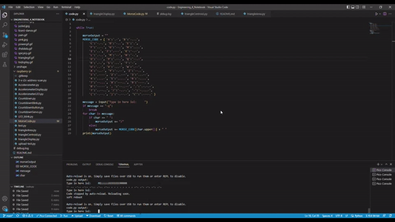

# Engineering_4_Notebook

&nbsp;

## Table of Contents
* [Launchpad Part 1](#launchpad-part-1)
* [Launchpad Part 2](#launchpad-part-2)
* [Launchpad Part 3](#launchpad-part-3)
* [Launchpad Part 4](#launchpad-part-4)
* [Crash Avoidance Part 1](#crash-avoidance-part-1)
* [Crash Avoidance Part 2](#crash-avoidance-part-2)
* [Crash Avoidance Part 3](#crash-avoidance-part-3)
* [Landing Area Part 1](#landing-area-part-1)
* [Landing Area Part 2](#landing-area-part-2)
* [Onshape_Assignment_Template](#Onshape_Assignment_Template)

&nbsp;

## Launchpad Part 1

### Assignment Description

Countdown from 10 seconds to 0 (liftoff). Print that countdown to the serial monitor.

### Evidence 


### Code
[Countdown.py](https://github.com/inovotn04/Engineering_4_Notebook/blob/main/raspberry-pi/Countdown.py)

### Reflection

Using a for loop for this is the easiest way. To make it count down and not count up make sure you have all three parameters in your for loop and the third one is negative. Also if you want it starting at 10 you're gonna need it to be 11 so it actually prints 10, if that makes sense. 

&nbsp;

## Launchpad Part 2

### Assignment Description

Countdown from 10 seconds to 0 (liftoff). Print that countdown to the serial monitor. Blink a red light each second of the countdown, and turn on a green LED to signify liftoff.


### Evidence 


### Wiring


### Code
[CountdownBlink.py](https://github.com/inovotn04/Engineering_4_Notebook/blob/main/raspberry-pi/CountdownBlink.py)

### Reflection

Long leg of LED goes to positive. Turn the LED on and off every half seconds so it does a full blink every second. Have a time.sleep at the end or put it in a while True loop so you can actually see the green LED turn on before the code finishes running. 

&nbsp;

## Launchpad Part 3

### Assignment Description

Countdown from 10 seconds to 0 (liftoff). Print that countdown to the serial monitor. Blink a red light each second of the countdown, and turn on a green LED to signify liftoff. Include a physical button that starts the countdown. 

### Evidence 


### Wiring


### Code
[CountdownButton.py](https://github.com/inovotn04/Engineering_4_Notebook/blob/main/raspberry-pi/CountdownButton.py)

### Reflection

Hypothetically there is probably an easier way to do this asssignment, that being said what I did works. Keep in mind! the "if not button.value" should be changed to "if button.value" and vice versa if you are wiring the button differently, not to ground and to the power pin instead. Also in the future perhaps find a way to code it more cleanly so instead of it checking to see if the button has been pressed every half second, it is able to continuously check, if possible.

&nbsp;

## Launchpad Part 4

### Assignment Description

Countdown from 10 seconds to 0 (liftoff). Print that countdown to the serial monitor. Blink a red light each second of the countdown, and turn on a green LED to signify liftoff. Include a physical button that starts the countdown. Actuate a 180 degree servo on liftoff to simulate the launch tower disconnecting.


### Evidence 


### Code
[CountdownServo.py](https://github.com/inovotn04/Engineering_4_Notebook/blob/main/raspberry-pi/CountdownServo.py)

### Wiring


### Reflection
The servo was easy enough, just adding a few lines of code. Watch out for the wiring because I accidentally wired the ground wire to 3v3 and it temporarily shorted my pico, didn't fry it though. If you want to do the spicy version where it begins to sweep at 3 seconds the easiest way is to use time.monotonic, but you technically don't have to if you have some crazy if statements and for loops but frankly that's just above my pay grade (I'm not getting paid).


&nbsp;

## Crash Avoidance Part 1

### Assignment Description

Create a module that has an accelerometer that continuously reports x, y, and z acceleration values on the serial monitor.


### Evidence 


### Code
[Accelerometer.py](https://github.com/inovotn04/Engineering_4_Notebook/blob/main/raspberry-pi/Accelerometer.py)

### Wiring


### Reflection
Wiring was super easy it's weird that you only wire one side of the accelerometer though. As far as the code goes I think the f string is easiest for printing. You may not have to slap the mpu inputs into variables and you could directly pull into the print string but I haven't tried it and frankly I am too scared to, but it could save you a couple lines of code. Don't be alarmed by your z variable printing ~9.8 that's just gravity.


&nbsp;

## Crash Avoidance Part 2

### Assignment Description

Create a module that has an accelerometer that continuously reports x, y, and z acceleration values on the serial monitor. The module must have an LED that turns on if the helicopter is tilted to 90 degrees. The module must be powered by a mobile power source. 


### Evidence 


### Code
[AccelerometerLED.py](https://github.com/inovotn04/Engineering_4_Notebook/blob/main/raspberry-pi/AccelerometerLED.py)

### Wiring


### Reflection
This assignment was actually dead easy. Everything worked perfectly the first time. I think I could maybe give you advice in terms of find the right value for the if statement to check whether it's 90 degrees, personally mine was pretty jumpy so I set it to 1 for the z variable.


&nbsp;

## Crash Avoidance Part 3

### Assignment Description
Create a module that has an accelerometer that continuously reports x, y, and z acceleration values on the serial monitor. The module must have an LED that turns on if the helicopter is tilted to 90 degrees. The module must be powered by a mobile power source. The module must have an onboard screen that prints x, y, and z angular velocity values (rad/s) rounded to 3 decimal places.


### Evidence 


### Code
[AccelerometerDisplay.py](https://github.com/inovotn04/Engineering_4_Notebook/blob/main/raspberry-pi/AccelerometerDisplay.py)

### Wiring


### Reflection
This was pretty challenging, in terms of getting the wiring to work and working with the pretty finicky code. Main thing to remember is that i2c wiring is always off of two pins, this does however mean the coding is a bit harder because you have to put in the address in a long initialization statement for each device. Also make sure to use the code to find the addresses of the devices, and if you're not finding them try reconnecting and checking wiring.

&nbsp;

## Landing Area Part 1

### Assignment Description
Create a program which calculates the area of a triangle. The code must ask for the user to input a set of three coordinates in (x,y) format. The triangle area must be determined using a function. If the user inputs coordinates incorrectly (letters or improper format) the code should return to the input stage, it should not throw an error or exit the script. The triangle area must be printed to the screen in this format: “The area of the triangle with vertices (x,y), (x,y), (x,y) is {area} square km. The code must return to the input stage after printing the area, and wait for user input.


### Evidence 


### Code
[triangleArea.py](https://github.com/inovotn04/Engineering_4_Notebook/blob/main/raspberry-pi/triangleArea.py)


### Reflection
The split function formats the output as a list, so to access it you need to do _your output name_[_number of item in list_]. For example if I did 
```python
txt = "69, 420"
output = txt.split(, )
```
I would have to access one of those numbers by saying
```python
x = output[1]
```
to get the number "420." Other than that, using 'try' and 'except' is actually astoundingly simple and horrifically helpful so it's important to use that. The only other problem was the way I formatted my math statement. Python doesn't recognize 'a(b)' as multiplication so you have to format that as 'a*(b)' and that caught me up for a while.

&nbsp;

## Landing Area Part 2

### Assignment Description

Create a program which calculates the area of a triangle. The code must ask for the user to input a set of three coordinates in (x,y) format. The triangle area must be determined using a function. If the user inputs coordinates incorrectly (letters or improper format) the code should return to the input stage, it should not throw an error or exit the script. The triangle area must be printed to the screen in this format: “The area of the triangle with vertices (x,y), (x,y), (x,y) is {area} square km. The code must return to the input stage after printing the area, and wait for user input. An onboard OLED screen must plot each triangle on a graph relative to the base location.

### Evidence 


### Wiring


### Code

[triangleDisplay.py](https://github.com/inovotn04/Engineering_4_Notebook/blob/main/raspberry-pi/triangleDisplay.py)

### Reflection
This one is literally just adding a display. I guess like remember the coordinates have 64, 32 as the center. Good luck in your future travels friend.

&nbsp;

## Landing Area Part 3

### Assignment Description

Create a program which calculates the area of a triangle. A list of coordinates must be hard coded into the script. The triangle area must be determined using a function. The code must select the triangle with the closest centroid that has an area > 100 km^2. An onboard screen must plot each triangle as it is evaluated on a graph relative to the base. The code must print the following text “The closest suitable landing area has vertices ({x}, {y}, {z}). The area is {area} km2 and the centroid is {distance} km away from base."

### Evidence 


### Wiring


### Code

[triangleCentroid.py](https://github.com/inovotn04/Engineering_4_Notebook/blob/main/raspberry-pi/triangleCentroid.py)


### Reflection
There's a lot of things to say about this. Firstly, put your calculation for the triangle center and the triangle area in two different function. If you don't do this you'll have to do so many lists and other stuff. Furthermore in the end it probably will not work at all, or at least that's what I discovered. If you feel like making more work for yourself then put it all in one function, see if I care.


&nbsp;

## Morse Code Part 1

### Assignment Description

Create a which accepts text input by the user. If the user types “-q”, your script must exit. If the user types anything else, your script must translate the text to morse code dots and dashes, and print those to the monitor. The printed text must use a space to show breaks between letters, and a slash to show breaks between words


### Evidence 



### Code

[MorseCode.py](https://github.com/inovotn04/Engineering_4_Notebook/blob/main/raspberry-pi/MorseCode.py)


### Reflection
If you're cool like me your code will be amazing like mine. I think the only thing is there's some characters missing from the dictionary so if you want to add a ~ then go for it. Also make sure to define an empty string at the top of your code to add on to. You see that empty string? Look at it. Do it.


&nbsp;

## Morse Code Part 1

### Assignment Description

Create a which accepts text input by the user. If the user types “-q”, your script must exit. If the user types anything else, your script must translate the text to morse code dots and dashes, and print those to the monitor. The printed text must use a space to show breaks between letters, and a slash to show breaks between words. The script must flash an LED to transmit the morse code message using the timing sequence shown below

### Evidence 


### Wiring


### Code

[MorseCodeBlink.py](https://github.com/inovotn04/Engineering_4_Notebook/blob/main/raspberry-pi/MorseCodeBlink.py)


### Reflection
You know how to make an LED blink. Do that. Then you just do a for loop and a bunch of if statements for the dots and dashes. It's simple. It's so horrendously simple. I don't know how to reflect on this. I think I made it a bit less efficient by adding extra 'led.value(False)' lines that didn't need to be there so maybe get rid of those if you feel like it. That's all.


&nbsp;

## Onshape_Assignment_Template

### Assignment Description

Write your assignment description here. What is the purpose of this assignment? It should be at least a few sentences.

### Part Link 

[Create a link to your Onshape document](https://cvilleschools.onshape.com/documents/003e413cee57f7ccccaa15c2/w/ea71050bb283bf3bf088c96c/e/c85ae532263d3b551e1795d0?renderMode=0&uiState=62d9b9d7883c4f335ec42021). Don't forget to turn on link sharing in your Onshape document so that others can see it. 

### Part Image

Take a nice screenshot of your Onshape document. 

### Reflection

What went wrong / was challenging, how'd you figure it out, and what did you learn from that experience? Your goal for the reflection is to pass on knowledge that will make this assignment better or easier for the next person. Think about your audience for this one, which may be "future you" (when you realize you need some of this code in three months), me, or your college admission committee!

&nbsp;

## Media Test

Your readme will have various images and gifs on it. Upload a test image and test gif to make sure you've got the process figured out. Pick whatever image and gif you want!

### Test Link
[Take This You Filthy Animal](raspberry-pi/test.py)
### Test Image

### Test GIF

